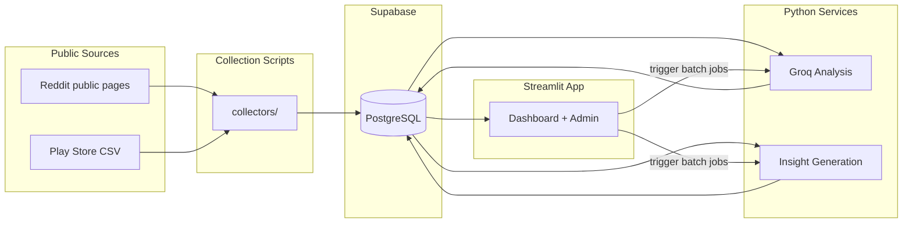
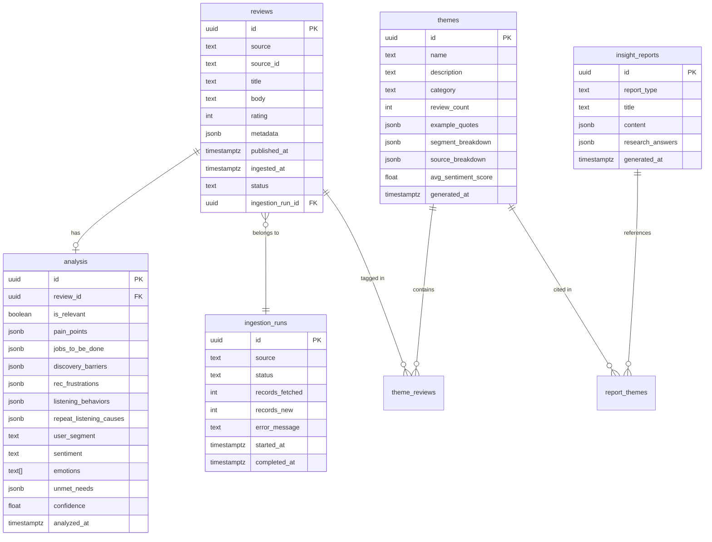
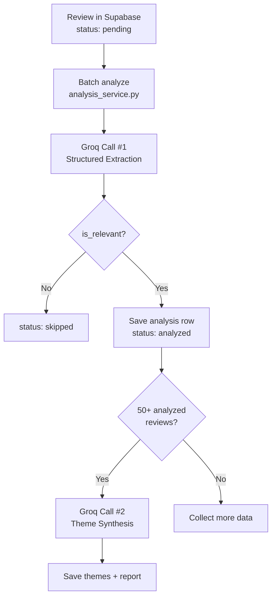

# Spotify Discovery Research Agent — Part 1 Architecture

> Lean architecture for a solo-built, PM portfolio research engine.  
> **Build target: 4–5 days** · **Stack: Streamlit · Supabase · Groq**  
> **Deploy: GitHub → Streamlit Community Cloud → one public URL**

---

## 1. System Architecture

### What Part 1 Is

A **single Streamlit application** — no separate backend, no second deployment, no API server. Python modules handle collection, AI analysis, and insight generation. Supabase stores everything. Streamlit reads from Supabase and renders the research dashboard.

```
┌─────────────────────────────────────────────────────────────────────────┐
│              REVIEW DISCOVERY ENGINE — PART 1 (Single App)              │
├─────────────────────────────────────────────────────────────────────────┤
│                                                                         │
│  PUBLIC SOURCES                                                         │
│  ──────────────                                                         │
│  Reddit public pages ──┐                                                │
│  (search + subreddit)  │                                                │
│  Play Store CSV ───────┤                                                │
│  App Store CSV ────────┘                                                │
│         │                                                               │
│         ▼                                                               │
│  COLLECTION SCRIPTS          (collectors/ — run locally or via app)     │
│         │                                                               │
│         ▼                                                               │
│  SUPABASE                    reviews · analysis · themes · reports      │
│         │                                                               │
│         ▼                                                               │
│  GROQ ANALYSIS               (services/groq_service.py)                 │
│         │                                                               │
│         ▼                                                               │
│  INSIGHT GENERATION          (services/insight_service.py)              │
│         │                                                               │
│         ▼                                                               │
│  STREAMLIT DASHBOARD         (app.py + pages/)                          │
│         │                                                               │
│         ▼                                                               │
│  ONE PUBLIC URL                your-app.streamlit.app                   │
│                                                                         │
└─────────────────────────────────────────────────────────────────────────┘
```

### Design Principles (Lean)

| Principle | How It Shows Up |
|---|---|
| **One app, one URL** | Entire Part 1 deploys as a single Streamlit app on Community Cloud |
| **No API layer** | Python service modules called directly — no FastAPI, no HTTP between components |
| **Scripts for collection** | Collectors run locally during dev; optional Admin page in Streamlit for re-runs |
| **Supabase is the hub** | All pipeline stages read/write to Supabase — the database is the integration layer |
| **Groq does the heavy lifting** | One extraction call per review; one synthesis call per report |
| **Pre-compute, then display** | Dashboard reads stored results — no live LLM calls on page load |
| **Demo-quality data > scale** | 200–500 curated reviews beat 10,000 noisy ones for a case study |
| **No Reddit API** | Public page scraping only — no PRAW, OAuth, or Reddit API keys |

### High-Level Flow



### Processing Model

No queues, no workers, no separate server. Processing is triggered in two ways:

**During development (recommended for bulk work):**
```bash
python scripts/collect_reddit.py
python scripts/import_csv.py --source play_store
python scripts/run_analysis.py --limit 100
python scripts/generate_insights.py
streamlit run app.py
```

**From the Streamlit Admin page (for demo / re-runs):**
```
1. Click "Collect Reddit"     → collectors/reddit_collector.py → Supabase (status: pending)
2. Click "Run Analysis"       → services/analysis_service.py → Groq → Supabase
3. Click "Generate Insights"  → services/insight_service.py → Groq → Supabase
4. Navigate dashboard pages   → read pre-computed data from Supabase
```

Use `st.spinner` + progress bars for long batch jobs. Streamlit Cloud has execution time limits — run large initial batches locally, use the app for demo-scale re-runs (≤50 reviews).

### Deployment

```
GitHub repo  →  push to main  →  Streamlit Community Cloud  →  https://your-app.streamlit.app
```

| Component | Platform | Notes |
|---|---|---|
| **Application** | Streamlit Community Cloud | Single deploy; `app.py` at repo root |
| **Database** | Supabase | Managed Postgres; free tier |
| **AI** | [GroqCloud](https://console.groq.com) API | `llama-3.3-70b-versatile` for extraction and synthesis |
| **Secrets** | Streamlit Cloud Secrets | All keys in one `.streamlit/secrets.toml` |

#### Streamlit Cloud Setup

1. Push repo to GitHub
2. Go to [share.streamlit.io](https://share.streamlit.io) → **New app**
3. Select repo, branch `main`, **Main file path:** `app.py`
4. Add secrets (see Environment Variables below)
5. Deploy — app is live at one public URL

No Render. No Docker. No Reddit API.

---

### Reddit Public Collection (No API)

Reddit data is collected from **publicly accessible pages only**. No Reddit API, PRAW, OAuth, or developer app credentials.

#### Sources

| Method | URL pattern | Purpose |
|---|---|---|
| **Subreddit search** | `old.reddit.com/r/{subreddit}/search?q={keyword}&restrict_sr=on` | Keyword-targeted discovery posts |
| **Subreddit listing** | `old.reddit.com/r/{subreddit}/new/` | Optional browse for recent posts |

#### Target subreddits

- `r/spotify`
- `r/truespotify`

#### Keywords

- recommendations
- discover weekly
- music discovery
- same songs
- algorithm
- playlist

#### Fields stored (per post)

| Field | Location | Description |
|---|---|---|
| `title` | `reviews.title` | Post title |
| `body` | `reviews.body` | Post selftext (or title if empty) |
| `subreddit` | `reviews.metadata.subreddit` | e.g. `spotify` |
| `score` | `reviews.metadata.score` | Upvote count |
| `url` | `reviews.metadata.url` | Permalink to the post |

#### Compliance

- Reddit `robots.txt` disallows **all automated fetching** (`Disallow: /`)
- **Recommended workflow:** open search URLs in a browser → save HTML → import via `--html-dir`
- Check `robots.txt` before any optional live fetch (`urllib.robotparser`)
- **2-second delay** between requests when live fetch is attempted
- Identifying `User-Agent` (no browser impersonation)
- Deduplicate by `post_id` / `(source, source_id)`

#### Manual collection workflow

```bash
# 1. Print URLs to open in browser
python scripts/collect_reddit.py --print-urls

# 2. Save each page as HTML → data/reddit_html/spotify_recommendations.html

# 3. Import saved pages
python scripts/collect_reddit.py --html-dir data/reddit_html --output data/reddit_posts.json
```

#### Example metadata JSON

```json
{
  "subreddit": "spotify",
  "score": 142,
  "url": "https://old.reddit.com/r/spotify/comments/abc123/...",
  "keyword": "discover weekly",
  "permalink": "https://old.reddit.com/r/spotify/comments/abc123/..."
}
```

---

## 2. Database Schema

### Entity Relationship



### Review Status Lifecycle

```
pending → analyzing → analyzed
                   → skipped   (not discovery-relevant)
                   → failed    (Groq error, retryable)
```

---

## 3. Supabase Table Design

Run this migration in the Supabase SQL editor or via `supabase/migrations/001_initial.sql`.

```sql
-- Enable UUID generation
create extension if not exists "pgcrypto";

-- ─── Ingestion Runs ───────────────────────────────────────────────
create table ingestion_runs (
  id              uuid primary key default gen_random_uuid(),
  source          text not null check (source in ('reddit', 'play_store', 'app_store')),
  status          text not null default 'running'
                    check (status in ('running', 'completed', 'failed')),
  records_fetched int  not null default 0,
  records_new     int  not null default 0,
  error_message   text,
  started_at      timestamptz not null default now(),
  completed_at    timestamptz
);

-- ─── Reviews (raw feedback) ───────────────────────────────────────
create table reviews (
  id               uuid primary key default gen_random_uuid(),
  source           text not null check (source in ('reddit', 'play_store', 'app_store')),
  source_id        text not null,
  title            text,
  body             text not null,
  rating           int check (rating between 1 and 5),
  metadata         jsonb not null default '{}',
  published_at     timestamptz,
  ingested_at      timestamptz not null default now(),
  status           text not null default 'pending'
                     check (status in ('pending', 'analyzing', 'analyzed', 'skipped', 'failed')),
  ingestion_run_id uuid references ingestion_runs(id),
  unique (source, source_id)
);

create index idx_reviews_status    on reviews(status);
create index idx_reviews_source    on reviews(source);
create index idx_reviews_published on reviews(published_at desc);

-- ─── Analysis (Groq output per review) ──────────────────────────
create table analysis (
  id                      uuid primary key default gen_random_uuid(),
  review_id               uuid not null unique references reviews(id) on delete cascade,
  is_relevant             boolean not null default false,
  pain_points             jsonb not null default '[]',
  jobs_to_be_done         jsonb not null default '[]',
  discovery_barriers      jsonb not null default '[]',
  rec_frustrations        jsonb not null default '[]',
  listening_behaviors     jsonb not null default '[]',
  repeat_listening_causes jsonb not null default '[]',
  user_segment            text,
  sentiment               text check (sentiment in ('positive', 'negative', 'neutral', 'mixed')),
  emotions                text[] not null default '{}',
  unmet_needs             jsonb not null default '[]',
  confidence              float check (confidence between 0 and 1),
  analyzed_at             timestamptz not null default now()
);

create index idx_analysis_relevant on analysis(is_relevant) where is_relevant = true;
create index idx_analysis_segment  on analysis(user_segment);

-- ─── Themes (aggregated patterns) ─────────────────────────────────
create table themes (
  id                  uuid primary key default gen_random_uuid(),
  name                text not null,
  description         text not null,
  category            text not null
                        check (category in (
                          'discovery_barrier', 'rec_frustration',
                          'listening_behavior', 'repeat_listening',
                          'unmet_need', 'segment_insight'
                        )),
  review_count        int not null default 0,
  example_quotes      jsonb not null default '[]',
  segment_breakdown   jsonb not null default '{}',
  source_breakdown    jsonb not null default '{}',
  avg_sentiment_score float,
  generated_at        timestamptz not null default now()
);

create index idx_themes_category on themes(category);

-- ─── Theme ↔ Review junction ──────────────────────────────────────
create table theme_reviews (
  theme_id  uuid not null references themes(id) on delete cascade,
  review_id uuid not null references reviews(id) on delete cascade,
  primary key (theme_id, review_id)
);

-- ─── Insight Reports ──────────────────────────────────────────────
create table insight_reports (
  id               uuid primary key default gen_random_uuid(),
  report_type      text not null default 'research_summary'
                     check (report_type in ('research_summary', 'segment_comparison', 'opportunity_brief')),
  title            text not null,
  content          jsonb not null default '{}',
  research_answers jsonb not null default '{}',
  generated_at     timestamptz not null default now()
);

-- ─── Report ↔ Theme junction ──────────────────────────────────────
create table report_themes (
  report_id uuid not null references insight_reports(id) on delete cascade,
  theme_id  uuid not null references themes(id) on delete cascade,
  primary key (report_id, theme_id)
);

-- ─── Dashboard views ──────────────────────────────────────────────
create view v_theme_summary as
select id, name, category, review_count, avg_sentiment_score,
       example_quotes, segment_breakdown, source_breakdown
from themes
order by review_count desc;

create view v_review_evidence as
select r.id, r.source, r.title, r.body, r.rating, r.published_at,
       a.user_segment, a.sentiment, a.discovery_barriers,
       a.rec_frustrations, a.unmet_needs
from reviews r
join analysis a on a.review_id = r.id
where a.is_relevant = true;
```

### JSON Field Shapes

**analysis.pain_points:**
```json
[{ "text": "Discover Weekly feels stale after 2 weeks", "severity": "high" }]
```

**insight_reports.research_answers:**
```json
{
  "q1_discovery_struggles": { "summary": "...", "top_themes": ["..."], "evidence_count": 87 },
  "q2_rec_frustrations":    { "summary": "...", "top_themes": ["..."], "evidence_count": 112 }
}
```

---

## 4. AI Analysis Workflow

### Overview

Two Groq call types. No embeddings, no vector DB — theme grouping is done by Groq synthesis over aggregated structured data.



### Call #1 — Per-Review Extraction

- **Model:** `llama-3.3-70b-versatile`
- **Input:** Review title + body + source + rating
- **Output:** Structured JSON (see Section 5)
- **Rate limiting:** Batches of 10, 1-second delay between batches
- **Error handling:** Set review status to `failed`; retry via `run_analysis.py --retry`

### Call #2 — Theme Synthesis & Report Generation

- **Model:** `llama-3.3-70b-versatile`
- **Input:** Aggregated extraction data from Supabase (compressed in Python)
- **Output:** Themes array + six research answers
- **Trigger:** `scripts/generate_insights.py` or Admin page button

### Aggregation Logic (Python, pre-Groq)

```python
# services/insight_service.py
def prepare_synthesis_input(analyses: list[dict]) -> dict:
    return {
        "total_relevant": len(analyses),
        "by_segment": group_by(analyses, "user_segment"),
        "by_source": group_by(analyses, "source"),
        "top_barriers":       frequency_count(analyses, "discovery_barriers", top=20),
        "top_frustrations":   frequency_count(analyses, "rec_frustrations", top=20),
        "top_behaviors":      frequency_count(analyses, "listening_behaviors", top=20),
        "top_repeat_causes":  frequency_count(analyses, "repeat_listening_causes", top=20),
        "top_unmet_needs":    frequency_count(analyses, "unmet_needs", top=20),
        "sentiment_distribution": count_by(analyses, "sentiment"),
        "sample_quotes": select_representative_quotes(analyses, n=30),
    }
```

---

## 5. Groq Prompts

### Prompt 1 — Review Extraction

**System instruction:**

```
You are a UX research analyst specializing in music streaming and discovery.
Analyze user feedback about Spotify and extract structured research signals.

Rules:
- Only extract what is explicitly stated or strongly implied in the text.
- If the review is not about music discovery, recommendations, or listening behavior, set is_relevant to false.
- Use concise, researcher-friendly language.
- Assign user_segment based on signals in the text; use "unknown" if unclear.
- confidence is 0.0–1.0 reflecting how clearly the review supports your extractions.

User segments (pick one):
- casual_listener — listens casually, limited exploration
- power_user — heavy daily use, knows features deeply
- new_user — recently joined, learning the app
- genre_purist — strong genre preferences, narrow taste
- playlist_curator — builds and manages playlists actively
- algorithm_skeptic — distrusts or fights recommendations
- unknown — insufficient signal
```

**User prompt template:**

```
Analyze this user feedback:

Source: {source}
Rating: {rating}/5
Title: {title}
Body: {body}

Return JSON matching this exact schema:
{
  "is_relevant": boolean,
  "pain_points": [{ "text": string, "severity": "low"|"medium"|"high" }],
  "jobs_to_be_done": [{ "job": string, "context": string }],
  "discovery_barriers": [{ "barrier": string, "category": string }],
  "rec_frustrations": [{ "frustration": string, "feature": string }],
  "listening_behaviors": [{ "behavior": string, "intent": string }],
  "repeat_listening_causes": [{ "cause": string, "explanation": string }],
  "user_segment": string,
  "sentiment": "positive"|"negative"|"neutral"|"mixed",
  "emotions": [string],
  "unmet_needs": [{ "need": string, "opportunity": string }],
  "confidence": number
}
```

**Groq config (OpenAI SDK + Groq endpoint):**
```python
from openai import OpenAI

client = OpenAI(api_key=api_key, base_url="https://api.groq.com/openai/v1")
response = client.chat.completions.create(
    model="llama-3.3-70b-versatile",
    messages=[
        {"role": "system", "content": system_instruction},
        {"role": "user", "content": user_prompt},
    ],
    response_format={"type": "json_object"},
    temperature=0.2,
)
```

---

### Prompt 2 — Theme Synthesis

**System instruction:**

```
You are a senior product researcher at Spotify preparing a discovery research brief.
Given aggregated analysis data from hundreds of user reviews, synthesize patterns into
clear themes and answer six research questions with evidence-backed summaries.

Rules:
- Every theme must be grounded in the frequency data provided.
- Include 2–3 verbatim user quotes per theme from the sample_quotes provided.
- Rank themes by frequency × severity.
- Be specific — name actual Spotify features (Discover Weekly, Daily Mix, Radio, etc.) when data supports it.
- Write for a PM audience: clear, concise, actionable.
```

**User prompt template:**

```
Here is aggregated research data from {total_relevant} discovery-relevant user reviews:

SEGMENT BREAKDOWN:      {by_segment}
SOURCE BREAKDOWN:       {by_source}
TOP DISCOVERY BARRIERS: {top_barriers}
TOP REC FRUSTRATIONS:   {top_frustrations}
TOP LISTENING BEHAVIORS: {top_behaviors}
TOP REPEAT-LISTENING CAUSES: {top_repeat_causes}
TOP UNMET NEEDS:        {top_unmet_needs}
SENTIMENT DISTRIBUTION: {sentiment_distribution}
SAMPLE USER QUOTES:     {sample_quotes}

Return JSON matching this schema:
{
  "themes": [{
    "name": string,
    "description": string,
    "category": "discovery_barrier"|"rec_frustration"|"listening_behavior"|"repeat_listening"|"unmet_need"|"segment_insight",
    "review_count_estimate": number,
    "example_quotes": [{ "quote": string, "source": string }],
    "segment_breakdown": { "segment_name": number },
    "source_breakdown": { "source_name": number },
    "avg_sentiment_score": number
  }],
  "research_answers": {
    "q1_discovery_struggles":  { "summary": string, "top_themes": [string], "evidence_count": number },
    "q2_rec_frustrations":     { "summary": string, "top_themes": [string], "evidence_count": number },
    "q3_listening_behaviors":  { "summary": string, "top_themes": [string], "evidence_count": number },
    "q4_repeat_listening":     { "summary": string, "top_themes": [string], "evidence_count": number },
    "q5_segment_differences":  { "summary": string, "top_themes": [string], "evidence_count": number },
    "q6_unmet_needs":          { "summary": string, "top_themes": [string], "evidence_count": number }
  },
  "executive_summary": string
}
```

---

## 6. Folder Structure

```
spotifyresearch/
├── app.py                            # Streamlit entry point → Overview page
├── requirements.txt                  # All dependencies (single file for Cloud deploy)
│
├── pages/
│   ├── 1_Themes.py                   # Theme explorer
│   ├── 2_Evidence.py                 # Searchable review evidence
│   ├── 3_Segments.py                 # Segment comparison charts
│   ├── 4_Research_Report.py          # Six research questions answered
│   └── 5_Admin.py                    # Pipeline controls (collect / analyze / generate)
│
├── collectors/                       # Public source → Supabase
│   ├── reddit_collector.py           # Public Reddit pages (no API)
│   ├── csv_importer.py               # Import Play Store / App Store CSV
│   └── normalizer.py                 # Source-specific → unified review shape
│
├── services/                         # Core business logic
│   ├── supabase_client.py            # DB read/write wrapper
│   ├── groq_service.py             # Groq API calls + JSON parsing
│   ├── analysis_service.py           # Batch review analysis orchestration
│   └── insight_service.py            # Aggregation + theme synthesis
│
├── prompts/
│   ├── extraction.py                 # Prompt 1 templates
│   └── synthesis.py                  # Prompt 2 templates
│
├── components/                       # Reusable Streamlit UI pieces
│   ├── theme_card.py
│   ├── quote_block.py
│   ├── stats_bar.py
│   └── filters.py
│
├── scripts/                          # CLI for local batch runs (dev workflow)
│   ├── collect_reddit.py
│   ├── import_csv.py
│   ├── run_analysis.py
│   └── generate_insights.py
│
├── supabase/
│   └── migrations/
│       └── 001_initial.sql
│
├── data/                             # Local only, gitignored
│   └── play_store_reviews.csv
│
├── .streamlit/
│   └── config.toml                   # Page title, layout, theme
│
├── problemstatement.md
├── architecture.md
└── README.md
```

### Streamlit Pages

| Page | File | What It Shows |
|---|---|---|
| **Overview** | `app.py` | Executive summary, key stats, sentiment chart, link to latest report |
| **Themes** | `pages/1_Themes.py` | Ranked themes by category, expandable cards with quotes |
| **Evidence** | `pages/2_Evidence.py` | Filterable table of reviews + analysis |
| **Segments** | `pages/3_Segments.py` | Bar charts comparing barriers/frustrations across segments |
| **Research Report** | `pages/4_Research_Report.py` | All 6 research questions with summaries and evidence counts |
| **Admin** | `pages/5_Admin.py` | Pipeline controls: collect, analyze, generate (with progress bars) |

All pages import from `services/` and query Supabase directly — no HTTP layer.

---

## 7. Application Modules

No REST API. Logic lives in Python modules imported by Streamlit pages and CLI scripts.

### Collectors (`collectors/`)

| Module | Function | Description |
|---|---|---|
| `reddit_collector.py` | `collect_reddit(...) → CollectResult` | Scrape public Reddit search/listing pages; no API |
| `csv_importer.py` | `import_csv(filepath, source) → int` | Parse Play Store / App Store CSV; upsert to Supabase |
| `normalizer.py` | `normalize(raw, source) → dict` | Map any source to unified review schema |

### Services (`services/`)

| Module | Function | Description |
|---|---|---|
| `supabase_client.py` | `get_reviews(status)`, `save_analysis(...)`, `save_themes(...)` | All Supabase read/write operations |
| `groq_service.py` | `extract_review(review) → dict`, `synthesize_themes(data) → dict` | Groq API with JSON mode |
| `analysis_service.py` | `analyze_batch(limit) → AnalysisResult` | Loop pending reviews through Groq Call #1 |
| `insight_service.py` | `generate_report() → ReportResult` | Aggregate analyses → Groq Call #2 → save themes + report |

### Data Queries (used by dashboard pages)

| Function | Used By | Returns |
|---|---|---|
| `get_overview_stats()` | `app.py` | Total reviews, relevant count, sentiment split, top segments |
| `get_themes(category=None)` | `1_Themes.py` | Themes sorted by review_count |
| `get_theme_detail(theme_id)` | `1_Themes.py` | Theme + linked reviews and quotes |
| `get_evidence(source, segment, sentiment)` | `2_Evidence.py` | Filtered relevant reviews with analysis |
| `get_segment_breakdown()` | `3_Segments.py` | Per-segment barriers, frustrations, counts |
| `get_latest_report()` | `4_Research_Report.py` | Most recent insight_report with research_answers |
| `get_ingestion_runs()` | `5_Admin.py` | Collection run history and status counts |

### CLI Scripts (`scripts/`)

Same modules as the Admin page — use locally for bulk processing:

```bash
python scripts/collect_reddit.py --subreddits spotify truespotify --limit 150
python scripts/import_csv.py --source play_store --file data/play_store_reviews.csv
python scripts/run_analysis.py --limit 100
python scripts/generate_insights.py
```

---

## 8. Development Roadmap

### Part 1 Build Schedule (Days 1–5)

| Day | Focus | Tasks | Done When |
|---|---|---|---|
| **Day 1** | Foundation | Supabase project + migration · `supabase_client.py` · Reddit collector · CSV importer · Seed 50+ reviews | Reviews in Supabase |
| **Day 2** | AI Pipeline | `groq_service.py` · extraction prompt · `analysis_service.py` · analyze 100+ reviews | Structured analysis in Supabase |
| **Day 3** | Insights | `insight_service.py` · synthesis prompt · theme + report generation · data query functions | Themes + 6 research answers stored |
| **Day 4** | Dashboard | `app.py` + all pages · deploy to Streamlit Cloud | Live public URL with real data |
| **Day 5** | Polish | Segment page · ingest to 300+ reviews · regenerate insights · styling · README + demo script | Portfolio-ready |

### Full Case Study Timeline (17 Days)

| Days | Phase | Focus |
|---|---|---|
| **1–5** | Part 1 | Review Discovery Engine (this architecture) |
| **6–8** | Part 2 | Problem definition from top themes |
| **9–12** | Part 3 | Solution design — feature concept, flows, prioritization |
| **13–15** | Part 4 | Case study write-up — narrative, screenshots, slides |
| **16–17** | Buffer | Rehearse demo, finalize portfolio page |

### Day 1 Checklist

```
[ ] Create Supabase project
[ ] Run 001_initial.sql migration
[ ] Create requirements.txt (streamlit, supabase, openai, httpx, beautifulsoup4, pandas, plotly)
[ ] Implement services/supabase_client.py
[ ] Implement collectors/reddit_collector.py (public pages, no API)
[ ] Implement collectors/csv_importer.py
[ ] Run scripts locally — verify 50+ reviews in Supabase
```

### Day 5 Demo Script (5 Minutes)

1. **Problem** (30s) — Open public URL; explain scattered discovery feedback
2. **Overview** (30s) — Show stats: 300+ reviews, 250+ relevant, sentiment split
3. **Evidence** (1min) — Filter a review; show structured extraction (barriers, segment, sentiment)
4. **Themes** (1.5min) — Walk top 5 themes with user quotes
5. **Research Report** (1.5min) — All 6 questions answered with evidence counts
6. **Segments** (30s) — Compare casual_listener vs algorithm_skeptic
7. **Close** (30s) — "This research informed my Part 2 problem definition"

---

## Architecture Decisions

| Decision | Choice | Why |
|---|---|---|
| Single Streamlit app | One deploy, one URL | Simplest path for solo PM portfolio; no infra to manage |
| No FastAPI | Direct Python module imports | No HTTP layer needed when UI and logic share a codebase |
| No Render | Streamlit Community Cloud only | Free hosting with GitHub auto-deploy |
| Supabase as integration hub | DB connects scripts, AI, and dashboard | Each stage reads/writes Supabase — no message passing |
| CLI scripts for bulk work | `scripts/` for local batch runs | Avoids Streamlit Cloud timeout limits on large jobs |
| Admin page for demo | `pages/5_Admin.py` | Lets you trigger pipeline live during portfolio demo |
| No vector DB | Groq synthesis over aggregated JSON | Simpler; sufficient for 200–500 reviews |
| Pre-computed insights | Generate once, display many times | Dashboard loads fast; no LLM cost on every page view |

---

## Environment Variables

All secrets live in **Streamlit Cloud Secrets** (and locally in `.streamlit/secrets.toml`, gitignored).

```toml
# .streamlit/secrets.toml

SUPABASE_URL = "https://xxx.supabase.co"
SUPABASE_SERVICE_KEY = "eyJ..."

GROQ_API_KEY = "gsk_..."
GROQ_MODEL = "llama-3.3-70b-versatile"

# Optional — User-Agent for public Reddit page requests (no API key)
REDDIT_USER_AGENT = "spotify-research-collector/1.0 (PM case study; public pages only)"
```

Access in code:
```python
import streamlit as st

supabase_url = st.secrets["SUPABASE_URL"]
groq_api_key = st.secrets["GROQ_API_KEY"]
groq_model   = st.secrets.get("GROQ_MODEL", "llama-3.3-70b-versatile")
```

For CLI scripts running locally, load the same file:
```python
# services/config.py
import tomllib, pathlib

def load_secrets() -> dict:
    path = pathlib.Path(".streamlit/secrets.toml")
    with open(path, "rb") as f:
        return tomllib.load(f)
```

---

## Related Documents

- [Problem Statement](./problemstatement.md) — Part 1 scope, research questions, and success criteria
