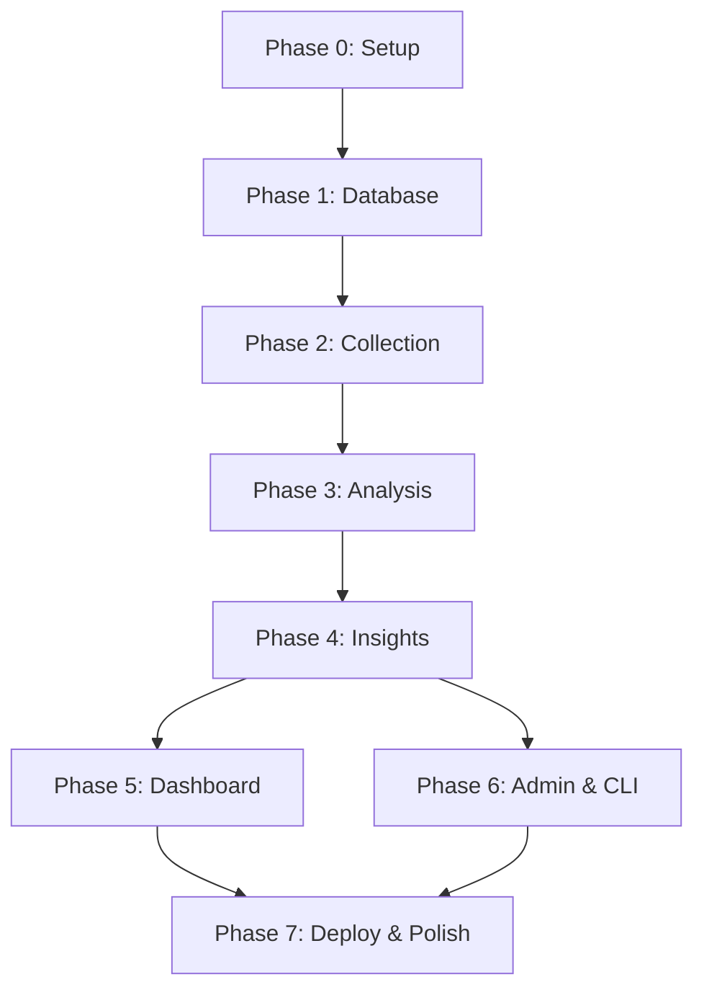

# Spotify Discovery Research Agent — Implementation Plan

> Phase-wise build plan for Part 1.  
> **Timeline:** 4–5 days · **Reference:** [architecture.md](./architecture.md)

---

## Overview

This plan implements the full pipeline as a **single Streamlit application**:

```
Public Sources → Collection Scripts → Supabase → Groq Analysis → Insight Generation → Streamlit Dashboard
```

Each phase produces a testable deliverable. Do not start the next phase until the current phase's **exit criteria** are met.

### Phase Summary

| Phase | Name | Duration | Exit Criteria |
|---|---|---|---|
| **0** | Project Setup | 2–3 hours | Repo scaffolded, secrets configured, Supabase live |
| **1** | Database & Data Layer | 3–4 hours | Schema migrated, `supabase_client.py` working |
| **2** | Data Collection | 4–5 hours | 50+ reviews ingested from 2 sources |
| **3** | Groq Analysis | 5–6 hours | 100+ reviews analyzed with structured JSON |
| **4** | Insight Generation | 4–5 hours | Themes + 6 research answers stored in Supabase |
| **5** | Streamlit Dashboard | 6–8 hours | All 5 pages rendering real data |
| **6** | Admin & CLI | 3–4 hours | Full pipeline runnable via scripts and Admin page |
| **7** | Deploy & Polish | 4–5 hours | Live public URL, 300+ reviews, portfolio-ready |

**Total estimated effort:** 31–40 hours (~4–5 working days)

---

## Phase 0 — Project Setup

**Goal:** Create the repo skeleton, install dependencies, and configure external services.

**Duration:** 2–3 hours

### Prerequisites

- GitHub account
- [Supabase](https://supabase.com) account (free tier)
- [Groq Console](https://console.groq.com/keys) API key (starts with `gsk_`)
- No Reddit API keys required — collection uses public pages only

### Tasks

| # | Task | Details |
|---|---|---|
| 0.1 | Initialize repo | Create GitHub repo `spotifyresearch`, clone locally |
| 0.2 | Create folder structure | Match [architecture.md §6](./architecture.md#6-folder-structure) — empty dirs + `__init__.py` where needed |
| 0.3 | Create `requirements.txt` | `streamlit`, `supabase`, `openai`, `httpx`, `beautifulsoup4`, `pandas`, `plotly`, `python-dotenv` |
| 0.4 | Create `.streamlit/config.toml` | Page title, wide layout, dark/light theme |
| 0.5 | Create `.streamlit/secrets.toml` | All API keys (add to `.gitignore`) |
| 0.6 | Create `services/config.py` | `load_secrets()` — reads `secrets.toml` for CLI scripts |
| 0.7 | Create Supabase project | Note `SUPABASE_URL` and `SUPABASE_SERVICE_KEY` |
| 0.8 | Create `.gitignore` | `secrets.toml`, `data/`, `__pycache__/`, `.env` |
| 0.9 | Stub `app.py` | Minimal Streamlit page: "Spotify Discovery Research Agent" + connection test |

### Files Created

```
spotifyresearch/
├── app.py
├── requirements.txt
├── .gitignore
├── .streamlit/config.toml
├── .streamlit/secrets.toml          (gitignored)
├── services/__init__.py
├── services/config.py
├── collectors/__init__.py
├── components/__init__.py
├── prompts/__init__.py
├── scripts/
├── pages/
├── supabase/migrations/
└── data/.gitkeep
```

### Exit Criteria

- [ ] `streamlit run app.py` launches without errors
- [ ] Supabase project created; credentials in `secrets.toml`
- [ ] Groq API key validated (simple test call)
- [ ] Public Reddit pages reachable (connection test)
- [ ] Repo pushed to GitHub

---

## Phase 1 — Database & Data Layer

**Goal:** Run the Supabase migration and build the database access layer all other phases depend on.

**Duration:** 3–4 hours

**Depends on:** Phase 0

### Tasks

| # | Task | Details |
|---|---|---|
| 1.1 | Write migration SQL | Copy schema from [architecture.md §3](./architecture.md#3-supabase-table-design) → `supabase/migrations/001_initial.sql` |
| 1.2 | Run migration | Execute in Supabase SQL Editor; verify all 7 tables + 2 views exist |
| 1.3 | Implement `supabase_client.py` | Supabase client singleton using secrets |
| 1.4 | Implement review CRUD | `insert_review()`, `get_reviews(status)`, `update_review_status()`, `upsert_review()` with dedup on `(source, source_id)` |
| 1.5 | Implement ingestion run tracking | `create_ingestion_run()`, `complete_ingestion_run()` |
| 1.6 | Implement analysis CRUD | `save_analysis()`, `get_analyses(is_relevant=True)` |
| 1.7 | Implement theme/report CRUD | `save_themes()`, `save_report()`, `get_latest_report()` |
| 1.8 | Implement dashboard queries | `get_overview_stats()`, `get_themes()`, `get_evidence()`, `get_segment_breakdown()` |
| 1.9 | Smoke test | Insert a manual test review via Python; read it back |

### Files Created / Modified

| File | Purpose |
|---|---|
| `supabase/migrations/001_initial.sql` | Full schema |
| `services/supabase_client.py` | All DB operations |

### Key Functions in `supabase_client.py`

```python
# Write
insert_review(review: dict) -> str
upsert_review(review: dict) -> str          # skip if source+source_id exists
update_review_status(review_id, status)
save_analysis(review_id, analysis: dict)
save_themes(themes: list[dict]) -> list[str]
save_report(report: dict) -> str
create_ingestion_run(source) -> str
complete_ingestion_run(run_id, fetched, new, error=None)

# Read
get_reviews(status=None, source=None, limit=100)
get_pending_reviews(limit=50)
get_analyses_with_reviews(is_relevant=True)
get_overview_stats()
get_themes(category=None)
get_theme_detail(theme_id)
get_evidence(source=None, segment=None, sentiment=None)
get_segment_breakdown()
get_latest_report()
get_ingestion_runs()
```

### Exit Criteria

- [ ] All tables visible in Supabase Table Editor
- [ ] Test review inserted and retrieved via `supabase_client.py`
- [ ] Dedup works — duplicate `(source, source_id)` is rejected/skipped
- [ ] `get_overview_stats()` returns zeros (no data yet, but no errors)

---

## Phase 2 — Data Collection

**Goal:** Ingest public user feedback from Reddit and Play Store CSV into Supabase.

**Duration:** 4–5 hours

**Depends on:** Phase 1

### Tasks

| # | Task | Details |
|---|---|---|
| 2.1 | Implement `normalizer.py` | `normalize(raw, source) → dict` — unified review shape for reddit, play_store, app_store |
| 2.2 | Implement `reddit_collector.py` | Scrape public old.reddit.com search/listing pages; no API |
| 2.3 | Implement `csv_importer.py` | Parse Play Store CSV columns (review text, rating, date); handle encoding |
| 2.4 | Wire deduplication | Call `upsert_review()` — skip existing `source_id` |
| 2.5 | Track ingestion runs | Create run record at start; update counts at end |
| 2.6 | Create `scripts/collect_reddit.py` | CLI: `--subreddits`, `--limit`, `--query` args |
| 2.7 | Create `scripts/import_csv.py` | CLI: `--source play_store`, `--file path` |
| 2.8 | Source Play Store CSV | Export or compile 100+ Spotify app reviews into `data/play_store_reviews.csv` |
| 2.9 | Run collection | Execute both scripts; target **50+ reviews minimum**, 150+ ideal |

### Reddit Collection Strategy (Public Pages — No API)

```
Method:       Public pages only — NO Reddit API
Primary:      Manual save HTML → import via --html-dir (robots.txt compliant)
Optional:     --live automated fetch (blocked by Reddit robots.txt)
Subreddits:   r/spotify, r/truespotify
Keywords:     recommendations, discover weekly, music discovery,
              same songs, algorithm, playlist
Search URL:   old.reddit.com/r/{sub}/search?q={keyword}&restrict_sr=on
Stored fields: title, body, subreddit, score, url (+ keyword in metadata)
```

### Normalized Review Shape

```python
{
    "source": "reddit" | "play_store" | "app_store",
    "source_id": "unique_id_from_source",
    "title": str | None,
    "body": str,
    "rating": int | None,
    "metadata": {
        "subreddit": "spotify",
        "score": 142,
        "url": "https://old.reddit.com/r/spotify/comments/...",
        "keyword": "discover weekly"
    },
    "published_at": datetime,
    "status": "pending",
    "ingestion_run_id": uuid,
}
```

### Files Created

| File | Purpose |
|---|---|
| `collectors/normalizer.py` | Source → unified schema |
| `collectors/reddit_collector.py` | Public Reddit page scraping (no API) |
| `collectors/csv_importer.py` | CSV file ingestion |
| `scripts/collect_reddit.py` | CLI wrapper |
| `scripts/import_csv.py` | CLI wrapper |
| `data/play_store_reviews.csv` | Play Store data (gitignored) |

### Exit Criteria

- [ ] `python scripts/collect_reddit.py --limit 100` inserts Reddit posts
- [ ] `python scripts/import_csv.py --source play_store --file data/play_store_reviews.csv` inserts reviews
- [ ] **50+ total reviews** in Supabase with `status = pending`
- [ ] At least **2 sources** represented (reddit + play_store)
- [ ] Ingestion runs logged in `ingestion_runs` table
- [ ] No duplicate reviews on re-run

---

## Phase 3 — Groq Analysis

**Goal:** Analyze each pending review with Groq and store structured extraction results.

**Duration:** 5–6 hours

**Depends on:** Phase 2 (reviews in Supabase)

### Tasks

| # | Task | Details |
|---|---|---|
| 3.1 | Create `prompts/extraction.py` | System instruction + user template from [architecture.md §5](./architecture.md#5-groq-prompts) |
| 3.2 | Implement `groq_service.py` | `extract_review(review) → dict` using `llama-3.3-70b-versatile` + JSON mode |
| 3.3 | Add JSON validation | Parse response; validate required fields; handle malformed JSON gracefully |
| 3.4 | Implement `analysis_service.py` | `analyze_batch(limit) → AnalysisResult` with progress tracking |
| 3.5 | Status lifecycle | Set `analyzing` → `analyzed` or `skipped` or `failed` per review |
| 3.6 | Rate limiting | Batch size 10, 1-second delay between batches |
| 3.7 | Error handling | On Groq failure: set status `failed`, log error, continue batch |
| 3.8 | Create `scripts/run_analysis.py` | CLI: `--limit 100`, `--retry` for failed reviews |
| 3.9 | Run analysis | Process all pending reviews; target **100+ analyzed** |
| 3.10 | Validate output | Spot-check 5 analyses in Supabase for quality and relevance filtering |

### Analysis Flow (per review)

```
1. Fetch review where status = pending
2. Set status = analyzing
3. Call groq_service.extract_review(review)
4. If is_relevant = false  → status = skipped, save minimal analysis
5. If is_relevant = true   → status = analyzed, save full analysis row
6. On exception             → status = failed
```

### Files Created

| File | Purpose |
|---|---|
| `prompts/extraction.py` | Prompt 1 templates |
| `services/groq_service.py` | Groq API wrapper (OpenAI SDK + GroqCloud) |
| `services/analysis_service.py` | Batch orchestration |
| `scripts/run_analysis.py` | CLI wrapper |

### Exit Criteria

- [ ] `python scripts/run_analysis.py --limit 100` completes without crashing
- [ ] **100+ reviews** with status `analyzed` or `skipped`
- [ ] Relevant reviews have populated: `discovery_barriers`, `rec_frustrations`, `user_segment`, `sentiment`
- [ ] Irrelevant reviews (billing, UI bugs) marked `skipped`
- [ ] Failed reviews < 5%; retry works via `--retry`
- [ ] Relevance rate roughly 60–80% (discovery-focused collection)

---

## Phase 4 — Insight Generation

**Goal:** Aggregate analyzed reviews into themes and a research report answering all 6 questions.

**Duration:** 4–5 hours

**Depends on:** Phase 3 (100+ analyzed reviews)

### Tasks

| # | Task | Details |
|---|---|---|
| 4.1 | Create `prompts/synthesis.py` | Prompt 2 templates from architecture |
| 4.2 | Implement aggregation helpers | `group_by()`, `frequency_count()`, `select_representative_quotes()` in `insight_service.py` |
| 4.3 | Implement `prepare_synthesis_input()` | Compress all relevant analyses into token-safe summary |
| 4.4 | Extend `groq_service.py` | Add `synthesize_themes(data) → dict` for Prompt 2 |
| 4.5 | Implement `generate_report()` | Full pipeline: fetch analyses → aggregate → Groq → save themes + report |
| 4.6 | Link themes to reviews | Populate `theme_reviews` junction table where possible |
| 4.7 | Create `scripts/generate_insights.py` | CLI wrapper |
| 4.8 | Run synthesis | Generate first report; inspect in Supabase |
| 4.9 | Validate research answers | Confirm all 6 keys present in `research_answers` JSON |
| 4.10 | Tune if needed | Adjust aggregation top-N or prompt if themes are too generic |

### Research Answer Keys (must all exist)

```
q1_discovery_struggles
q2_rec_frustrations
q3_listening_behaviors
q4_repeat_listening
q5_segment_differences
q6_unmet_needs
```

### Files Created

| File | Purpose |
|---|---|
| `prompts/synthesis.py` | Prompt 2 templates |
| `services/insight_service.py` | Aggregation + synthesis orchestration |
| `scripts/generate_insights.py` | CLI wrapper |

### Exit Criteria

- [ ] `python scripts/generate_insights.py` produces themes + report
- [ ] **10–20 themes** stored in `themes` table across multiple categories
- [ ] `insight_reports` contains report with all **6 research answers**
- [ ] Each theme has 2–3 `example_quotes`
- [ ] `executive_summary` is PM-readable, not generic AI fluff
- [ ] Dashboard query functions return theme and report data

---

## Phase 5 — Streamlit Dashboard

**Goal:** Build all dashboard pages that read pre-computed data from Supabase.

**Duration:** 6–8 hours

**Depends on:** Phase 4 (themes + report exist)

### Tasks

| # | Task | Page | Details |
|---|---|---|---|
| 5.1 | Build `components/stats_bar.py` | Shared | Metric tiles: total reviews, relevant, themes, sentiment |
| 5.2 | Build `components/theme_card.py` | Shared | Expandable card: name, description, quotes, counts |
| 5.3 | Build `components/quote_block.py` | Shared | Styled user quote with source badge |
| 5.4 | Build `components/filters.py` | Shared | Source / segment / sentiment dropdowns |
| 5.5 | Build `app.py` | Overview | Stats bar, sentiment pie chart (Plotly), executive summary, source breakdown |
| 5.6 | Build `pages/1_Themes.py` | Themes | Category filter, ranked theme cards, click-to-expand quotes |
| 5.7 | Build `pages/2_Evidence.py` | Evidence | Filterable dataframe, expand row to see full analysis JSON |
| 5.8 | Build `pages/3_Segments.py` | Segments | Bar charts: barriers and frustrations by segment |
| 5.9 | Build `pages/4_Research_Report.py` | Report | Six research questions as sections with summary + top themes + evidence count |
| 5.10 | Apply styling | All | Consistent headers, Spotify-adjacent color palette, wide layout |

### Page Requirements

#### Overview (`app.py`)
- 4 stat metrics at top
- Sentiment distribution chart
- Reviews by source chart
- Top 5 segments
- Latest executive summary (from report)
- Navigation hint to other pages

#### Themes (`pages/1_Themes.py`)
- Filter by category dropdown
- Sort by review_count (default)
- Each theme: name, description, quote block, segment/source breakdown

#### Evidence (`pages/2_Evidence.py`)
- Filters: source, segment, sentiment, keyword search
- Table: source, segment, sentiment, body preview
- Expandable detail: full body + all analysis fields

#### Segments (`pages/3_Segments.py`)
- Segment selector or grouped bar charts
- Top 3 barriers and frustrations per segment
- Review count per segment

#### Research Report (`pages/4_Research_Report.py`)
- One section per research question
- Summary paragraph, bullet top themes, evidence count badge
- Generated timestamp

### Exit Criteria

- [ ] All 5 pages load without errors
- [ ] Overview shows real stats from Supabase
- [ ] Themes page displays generated themes with quotes
- [ ] Evidence page filters work correctly
- [ ] Segments page shows comparison across ≥ 2 segments
- [ ] Research Report shows all 6 questions answered
- [ ] No live Groq calls on page load (reads from DB only)

---

## Phase 6 — Admin & CLI

**Goal:** Wire pipeline controls into the Admin page and finalize CLI scripts for bulk operations.

**Duration:** 3–4 hours

**Depends on:** Phases 2, 3, 4, 5

### Tasks

| # | Task | Details |
|---|---|---|
| 6.1 | Build `pages/5_Admin.py` | Pipeline control panel |
| 6.2 | "Collect Reddit" button | Calls `reddit_collector.collect_reddit()` — public pages only |
| 6.3 | "Import CSV" button | File uploader → `csv_importer.import_csv()` |
| 6.4 | "Run Analysis" button | Calls `analysis_service.analyze_batch(limit=50)` with `st.progress` |
| 6.5 | "Generate Insights" button | Calls `insight_service.generate_report()` with spinner |
| 6.6 | Status dashboard | Show counts: pending / analyzed / skipped / failed |
| 6.7 | Ingestion history | Table of recent `ingestion_runs` |
| 6.8 | Finalize CLI scripts | Ensure all 4 scripts have argparse, logging, and clear output |
| 6.9 | Create `scripts/run_full_pipeline.py` | Runs collect → analyze → generate in sequence |
| 6.10 | Test Admin page locally | Run small batch (10 reviews) end-to-end from UI |

### Admin Page Layout

```
┌─────────────────────────────────────────────────┐
│  Pipeline Status                                │
│  [342 total] [298 analyzed] [24 pending] [20 skipped] │
├─────────────────────────────────────────────────┤
│  1. Collect Data                                │
│  [Collect Reddit (50 posts)]  [Upload CSV]      │
├─────────────────────────────────────────────────┤
│  2. Analyze                                     │
│  [Run Analysis (50 pending)]  [Retry Failed]    │
├─────────────────────────────────────────────────┤
│  3. Generate Insights                           │
│  [Generate Research Report]                     │
├─────────────────────────────────────────────────┤
│  Ingestion History                              │
│  (table of recent runs)                         │
└─────────────────────────────────────────────────┘
```

> **Note:** Keep Admin batch limits ≤ 50 on Streamlit Cloud to avoid timeout. Use CLI scripts for bulk (300+) processing.

### Exit Criteria

- [ ] Admin page triggers each pipeline stage successfully
- [ ] Progress/spinner feedback shown during long operations
- [ ] Status counts update after each action
- [ ] All 4 CLI scripts run independently
- [ ] `run_full_pipeline.py` completes full cycle locally

---

## Phase 7 — Deploy & Polish

**Goal:** Deploy to Streamlit Community Cloud, load production dataset, and prepare portfolio demo.

**Duration:** 4–5 hours

**Depends on:** All previous phases

### Tasks

| # | Task | Details |
|---|---|---|
| 7.1 | Expand dataset | Run CLI scripts locally to reach **300+ reviews** |
| 7.2 | Re-run analysis + insights | Full pipeline on complete dataset |
| 7.3 | Quality review | Spot-check 10 random analyses; verify top themes make sense |
| 7.4 | Write `README.md` | Setup, local dev, deploy instructions, demo link |
| 7.5 | Push to GitHub | Ensure no secrets committed |
| 7.6 | Deploy Streamlit Cloud | Connect repo, set main file `app.py`, add secrets |
| 7.7 | Verify production | Test all pages on public URL |
| 7.8 | UI polish | Page icons, consistent spacing, empty-state messages |
| 7.9 | Prepare demo script | 5-minute walkthrough (see below) |
| 7.10 | Capture screenshots | For case study write-up (Part 4) |

### Deployment Checklist

```
[ ] requirements.txt complete and pinned (major versions)
[ ] app.py at repo root
[ ] No secrets in git history
[ ] Streamlit Cloud secrets configured (5 keys)
[ ] App loads at public URL within 60 seconds
[ ] All pages accessible from sidebar
[ ] Data visible (not empty states)
```

### Streamlit Cloud Secrets

```toml
SUPABASE_URL = "..."
SUPABASE_SERVICE_KEY = "..."
GROQ_API_KEY = "..."
GROQ_MODEL = "llama-3.3-70b-versatile"
REDDIT_USER_AGENT = "spotify-research-collector/1.0 (PM case study; public pages only)"
```

### 5-Minute Demo Script

| Step | Time | Action |
|---|---|---|
| 1 | 30s | Open public URL — state the problem (scattered discovery feedback) |
| 2 | 30s | Overview — 300+ reviews, sentiment split, executive summary |
| 3 | 1min | Evidence — filter one review, show structured AI extraction |
| 4 | 1.5min | Themes — walk top 5 themes with user quotes |
| 5 | 1.5min | Research Report — all 6 questions with evidence counts |
| 6 | 30s | Segments — compare casual_listener vs algorithm_skeptic |
| 7 | 30s | Close — "This research informs Part 2 problem definition" |

### Exit Criteria

- [ ] **Public URL live** and shareable
- [ ] **300+ reviews**, **250+ relevant**, **10+ themes**
- [ ] All 6 research questions answered with evidence
- [ ] README documents setup and architecture
- [ ] Demo rehearsed once end-to-end
- [ ] Screenshots saved for portfolio

---

## Dependency Graph



Phases 5 and 6 can run **in parallel** after Phase 4 completes.

---

## Risk Mitigation

| Risk | Impact | Mitigation |
|---|---|---|
| Streamlit Cloud timeout on large batches | Analysis fails mid-run | Run bulk jobs via CLI locally; limit Admin page to 50 reviews |
| Reddit blocks scraping / rate limits | Collection fails | 2s delay, robots.txt check, run locally, cache JSON output |
| Groq returns malformed JSON | Review marked failed | Retry logic; validate schema; log raw response for debugging |
| Low relevance rate (< 40%) | Weak insights | Tighten Reddit search query; filter Play Store reviews manually |
| Generic AI themes | Portfolio looks shallow | Tune synthesis prompt; require verbatim quotes; spot-check before deploy |
| Supabase free tier limits | Slow queries | Index already in schema; paginate evidence table; limit to 500 reviews |

---

## Daily Schedule (Suggested)

If working full days (~8 hours):

| Day | Phases | Focus |
|---|---|---|
| **Day 1** | 0 + 1 + 2 | Setup, database, collect 150+ reviews |
| **Day 2** | 3 + 4 | Analyze all reviews, generate first insights |
| **Day 3** | 5 | Build all dashboard pages |
| **Day 4** | 6 + 7 | Admin page, deploy, expand dataset, polish |
| **Day 5** | Buffer | Fix bugs, regenerate insights, rehearse demo, screenshots |

If working partial days (~4 hours):

| Day | Phases |
|---|---|
| **Day 1** | 0 + 1 |
| **Day 2** | 2 |
| **Day 3** | 3 |
| **Day 4** | 4 |
| **Day 5** | 5 |
| **Day 6** | 6 + 7 |
| **Day 7** | Buffer |

---

## Post–Part 1 (Case Study Continuation)

After Phase 7, Part 1 is complete. Remaining case study work (does not require code):

| Days | Part | Deliverable |
|---|---|---|
| 6–8 | Part 2 | Problem definition doc from top 3 themes |
| 9–12 | Part 3 | Solution design — feature concept, user flows |
| 13–15 | Part 4 | Case study write-up with app screenshots |
| 16–17 | Buffer | Rehearse presentation, finalize portfolio |

---

## Related Documents

- [Problem Statement](./problemstatement.md) — Scope, research questions, success criteria
- [Architecture](./architecture.md) — System design, schema, prompts, modules
